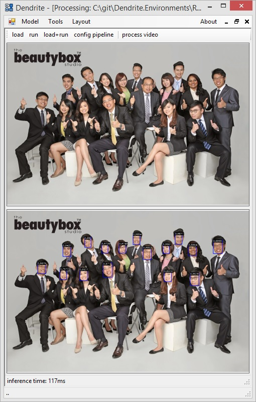

# Dendrite.Environments
Ready environments for [Dendrite](https://github.com/fel88/Dendrite)

# Supported models
## Object detection

1. [RetinaFace](/RetinaFace)
## Image processing

1. [MonoDepth](/MonoDepth)
2. [StyleTransfer](/StyleTransfer)

## Text detection

1. [CRAFT](/CRAFT)

# How to use 
## Single image process
1. Load .den file to Dendrite (Model->Inference->Simple)
2. Run inference by clicking 'load+run' and select image to process
3. Check result (you can click on the image to open it)

## Video process
1. Load .den file to Dendrite (Model->Inference->Simple)
2. Click 'Process video' button and select video file to process
3. Set path to output video file (inference result will be saved there)
4. Wait until inference will be completed
5. Open result video and check it out

## .DEN file format

.den file is a zip archive with an ONNX (or caffemodel, etc..) file and a pipeline configuration inside
